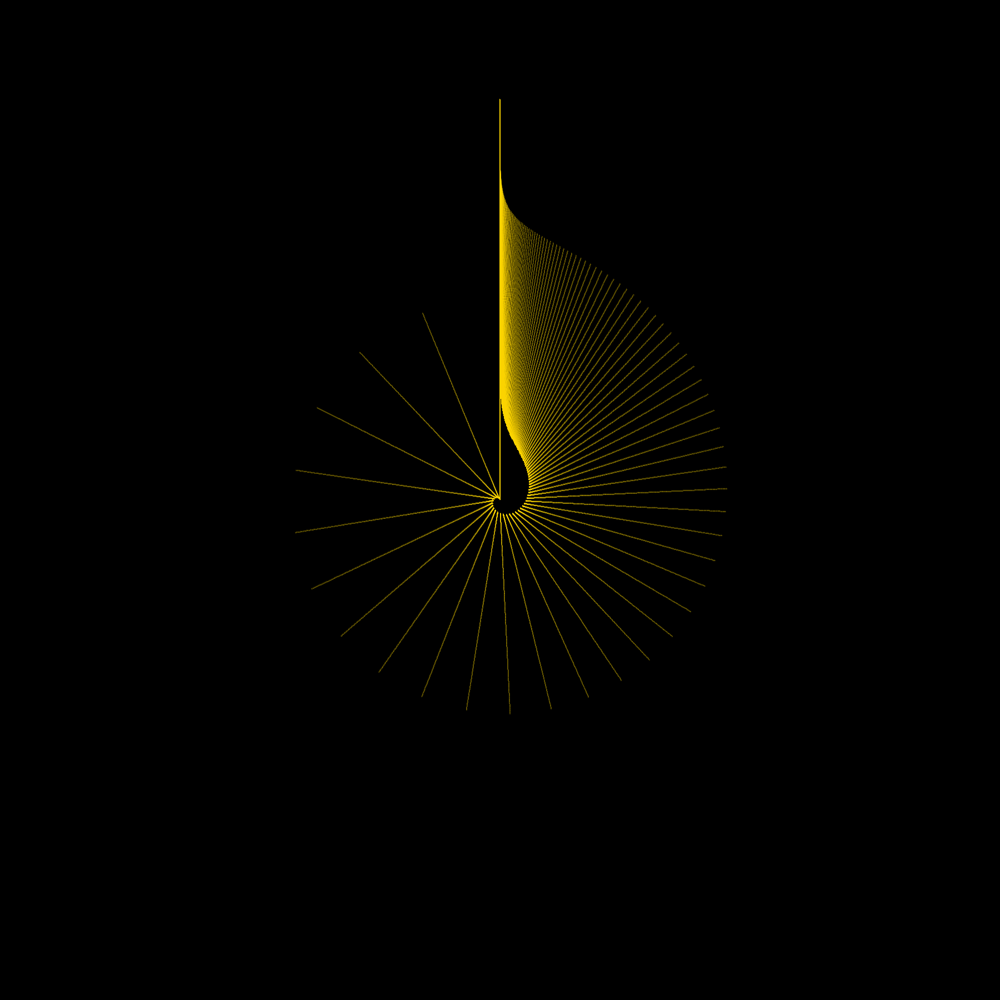
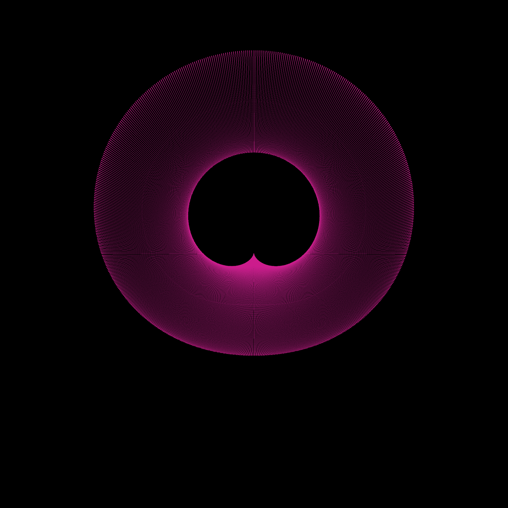
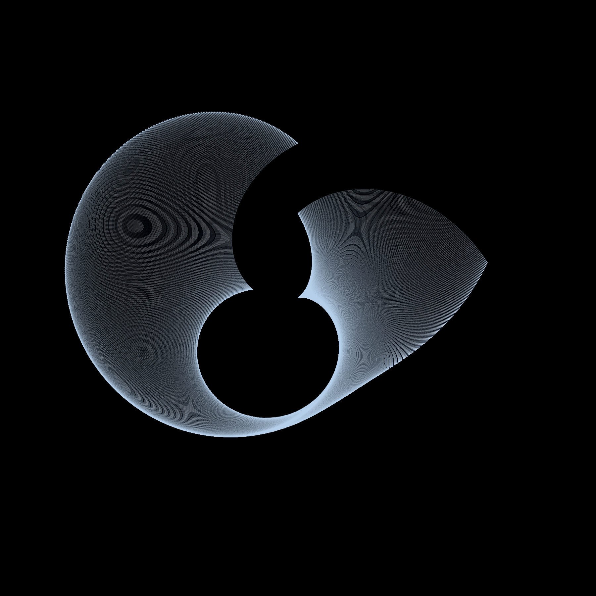
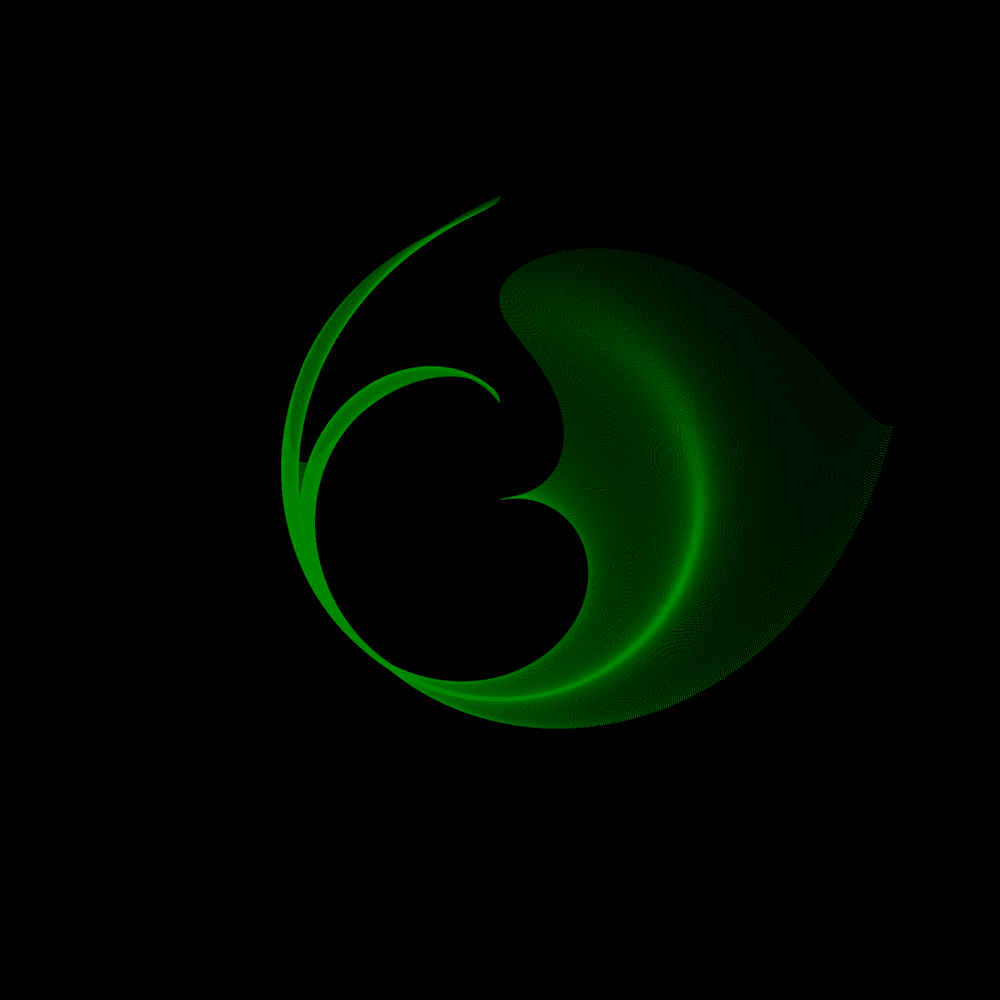
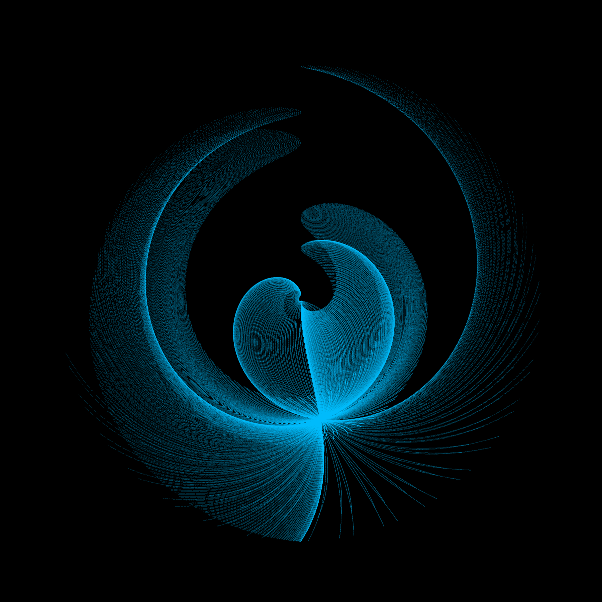
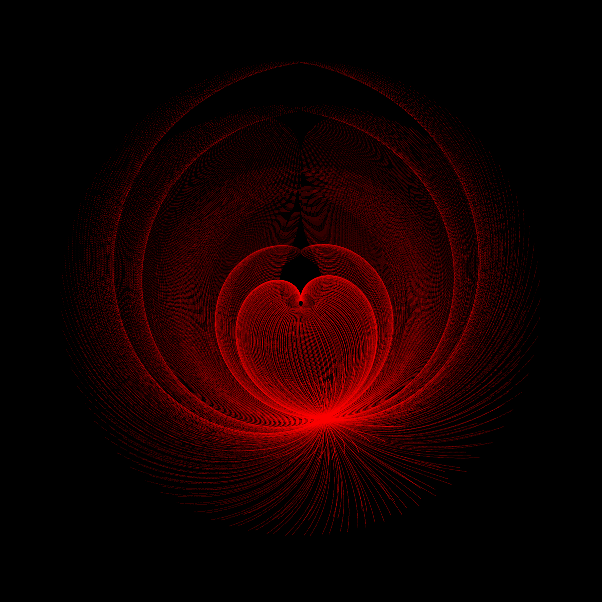
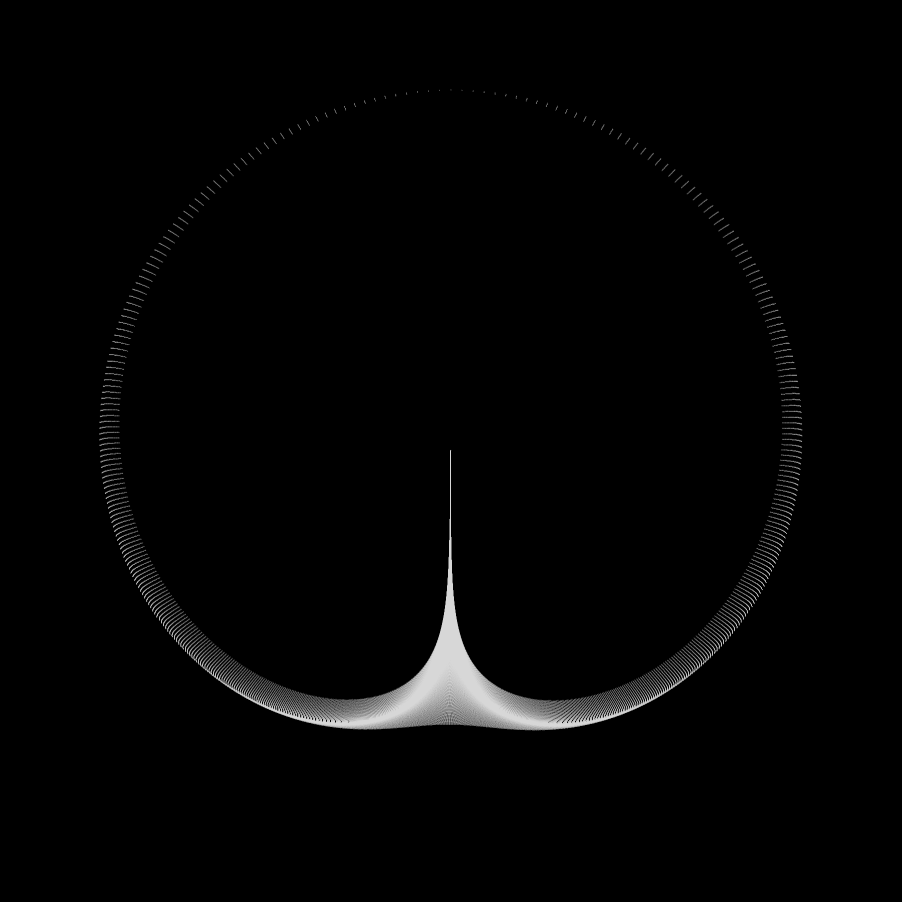
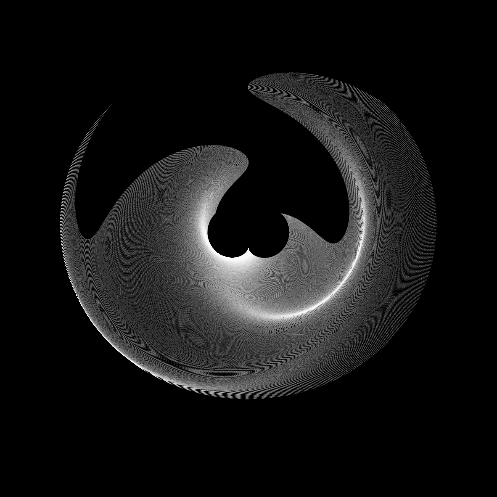
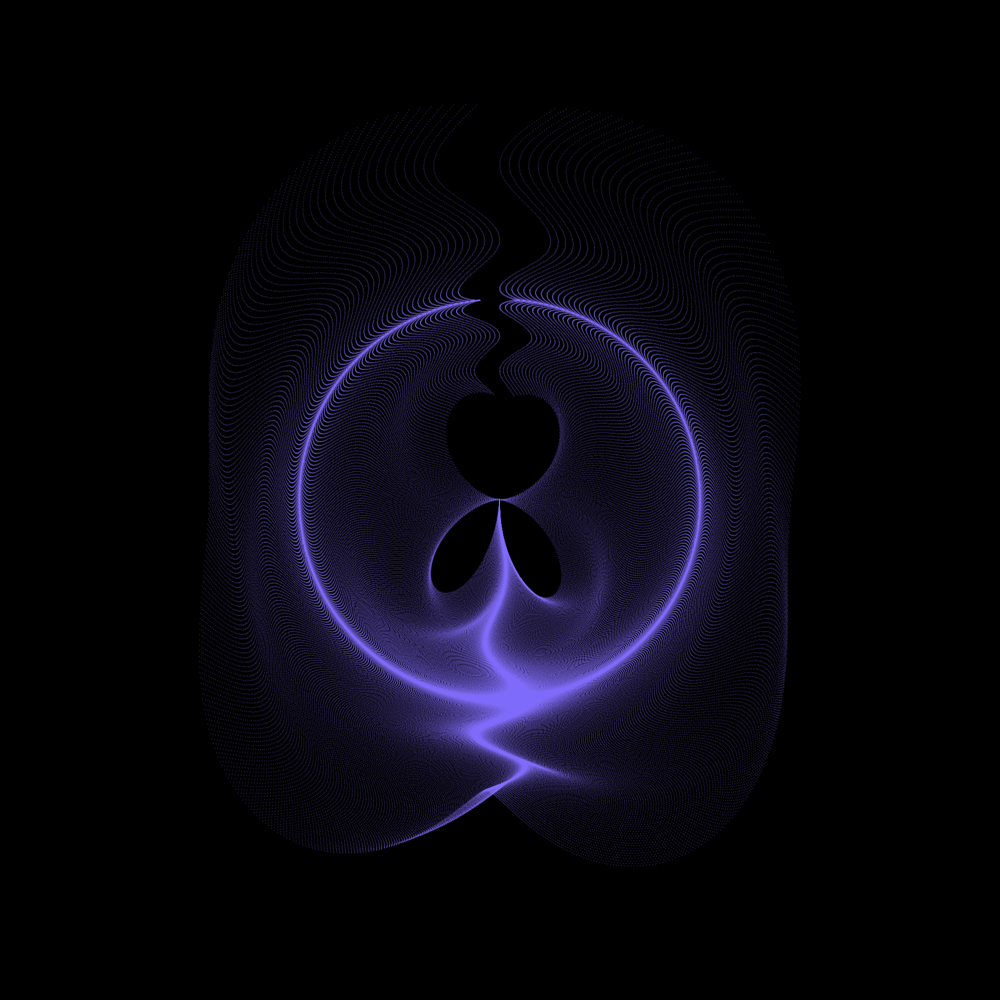

```{r setup, include=FALSE}
knitr::opts_chunk$set(echo = TRUE)
```


# El objetivo de este trabajo es utilizar los métodos vistos en el curso para producir una colección de imágenes artísticas.

## 1) Las imágenes son realizadas con las fucniones del paquete "generativeart".

## 2) La fórmula que utiliza la función "generate_img" recibe dos componentes X y Y, estas a al vez pueden obtener el valor de dos variables x_i y y_i.

## 3) Las imágenes se realizan con ayuda de las cordenadas polares que se generan según los valores de la fórmula X y Y.


```{r , warning=FALSE , include=FALSE , echo=TRUE}
library(generativeart)
#devtools::install_github("cutterkom/generativeart") 
library(ambient)
library(dplyr)
library(MASS)
library(MVN)
library(linpk)
library(class)
library(printr)

# set the paths
IMG_DIR <- "img/"
IMG_SUBDIR <- "everything/"
IMG_SUBDIR2 <- "handpicked/"
IMG_PATH <- paste0(IMG_DIR, 
                   IMG_SUBDIR)


LOGFILE_DIR <- "logfile/"
LOGFILE <- "logfile.csv"
LOGFILE_PATH <- paste0(LOGFILE_DIR, 
                       LOGFILE)

# create the directory structure
generativeart::setup_directories(IMG_DIR, 
                                 IMG_SUBDIR, 
                                 IMG_SUBDIR2, 
                                 LOGFILE_DIR)
```


# Arte con regresión Logística


Se generó un conjunto de datos de manera aleatoria para crear un gráfico en $R^3$, la superficie viene dada por  $Z= f(x,y) = 4X - Y^2 +Y$ con:

* X variable aleatoria tal que $X \sim U(1,500)$

* Y variable aletoria tal que $Y \sim N(7,11^2)$

Además se usa la semilla correspondiente al número: 1152459914.

```{r, include=TRUE , echo=FALSE}
set.seed(1152459914)
x= sort(runif(n = 100 , min = 1 , max = 500))
y= sort(rnorm(n = 100 ,mean = 7 , sd = 121))


grafo =function(x,y) 4*x - y^2 + y


z_val <- grafo(x = x , y = y)
z_val <- ifelse(z_val < -10716.1 ,  yes = 0 , no = 1)


z=outer(x, y, grafo)


par(mfrow = c(2,2))
persp(x,y,z, phi = 0, theta = 90, col = "darkolivegreen1", main="Superficie")

persp(x,y,z, phi = 30 , theta = 60, col = "darkolivegreen1", main="Superficie")

persp(x,y,z, phi = 60 , theta = 30, col = "darkolivegreen1", main="Superficie")

persp(x,y,z, phi = 90 , theta = 0, col = "darkolivegreen1", main="Superficie")
```


Se asigna valores de 0 y 1 dependiendo al valor de Z en la superficia, si Z es menor que la media "-10716.1" entonces es 0 y si es mayor entonces es 1. 


Esto es solo para crear un modelo de regresión logística con 3 covariables para después predecir con valores aleatorios y generar predicciones aleatorias que ayudan a formar la obra de arte, estos valores predichos aleatorios se representan como $\widehat Y$.


```{r, echo=TRUE, include=FALSE}


datos <- data.frame(Y = z_val , X_1 =4*x , X_2 =  y , X_3 = - y^2 )

mod_fit <- glm(Y ~ . , data =  datos , family = "binomial")

set.seed(1152459914)
my_formula1 <- list(
  x = quote(predict(mod_fit , data.frame(X_1 = 4*runif(n = 1 , min = 1 , max = 500) ,
                                         X_2 = rnorm(n = 1 ,mean = 7 , sd = 121),
                                         X_3 = -rnorm(n = 1 ,mean = 7 , sd = 121) ^2)) ^ x_i  ),
  
  y = quote(  y_i^2 - x_i^2 )
)


generativeart::generate_img(formula = my_formula1, 
                            nr_of_img = 1, # set the number of iterations
                            polar = T, 
                            filetype = "png", 
                            color = "#FFD700", 
                            background_color = "black")
```


# Primera obra



## Fórmula

* Componente **X**: $\widehat Y*x_i$

* Componente **Y**: $y_i^2 - x_i^2$ 


```{r, include=FALSE , echo=TRUE}

set.seed(1152459914)
my_formula2 <- list(
  x = quote(predict(mod_fit , data.frame(X_1 = 4*runif(n = 1 , min = 1 , max = 500) ,
                                         X_2 = rnorm(n = 1 ,mean = 7 , sd = 121),
                                         X_3 = -rnorm(n = 1 ,mean = 7 , sd = 121) ^2)) * x_i  ),
  
  y = quote(  (sin(y_i) - cos(x_i)) * predict(mod_fit , data.frame(X_1 = 4*runif(n = 1 , min = 1 , max = 500) ,
                                                             X_2 = rnorm(n = 1 ,mean = 7 , sd = 121),
                                                             X_3 = -rnorm(n = 1 ,mean = 7 , sd = 121) ^2)) )
)


generativeart::generate_img(formula = my_formula2, 
                            nr_of_img = 1, # set the number of iterations
                            polar = T, 
                            filetype = "png", 
                            color = "#D02090", 
                            background_color = "black")

```


# Segunda obra





## Fórmula


* Componente **X**: $\widehat Y ^{~~x_i}$

* Componente **Y**: $y_i^2 - x_i^2$ 


# Arte con  SVM


Para crear arte con Máquinas de Soporte Vectorial utilizamos la misma superficie para crear un modelo de predicción y utilizarlos para predecir valores aleatorios de $x_i ~ y ~y_i$, la predicción con valores aleatorios se sigue denotanndo como $\widehat Y$.


```{r, include=FALSE , echo=TRUE , warning=FALSE}
library(e1071)
svmfit =svm( Y~., data= datos , kernel ="linear", cost =10,scale =FALSE )
```


```{r, include=FALSE , echo=TRUE}

set.seed(1152459914)

my_formula3 <- list(
  x = quote(    predict( svmfit, data.frame(X_1 = 4*cos(x_i) ,
                                         X_2 = y_i,
                                         X_3 = -y_i^3))   ),
  
  y = quote(   predict( svmfit, data.frame(X_1 = 4*cos(x_i) ,
                                             X_2 = sin(y_i),
                                             X_3 = -y_i^3)))
)


generativeart::generate_img(formula = my_formula3, 
                            nr_of_img = 1, # set the number of iterations
                            polar = T, 
                            filetype = "png", 
                            color = "#B9D3EE", 
                            background_color = "black")


```


# Tercera obra





## Fórmula


* Componente **X**: $\widehat Y$ con $X_1 = 4*cos(x_i)$, $X_2 = y_i$  y $X_3 = -y_i^3$

* Componente **Y**: $\widehat Y$ con $X_1 = 4*cos(x_i)$, $X_2 = sin(y_i)$  y $X_3 = -y_i^3$ 


```{r, include=FALSE , echo=TRUE}

set.seed(1152459914)

my_formula4 <- list(
  x = quote( predict( svmfit, data.frame(X_1 = 4*cos(x_i) ,
                                        X_2 = y_i,
                                        X_3 = -y_i^3))  ),
  
  y = quote(runif(n = 1 , min = -10,10) * x_i*(y_i - y_i^2) )
)


generativeart::generate_img(formula = my_formula4, 
                            nr_of_img = 1, # set the number of iterations
                            polar = T, 
                            filetype = "png", 
                            color = "#008B00", 
                            background_color = "black")

```


# Cuarta obra





## Fórmula


* Componente **X**: $\widehat Y$ con $X_1 = 4*cos(x_i)$, $X_2 = y_i$  y $X_3 = -y_i^3$

* Componente **Y**: **runif(n = 1 , min = -10,10)**$x_i*(y_i - y_i^2)$


# Arte con variables mutivariadas 


Para crear arte con variables multivaridas priemro se deben simular dichas variables, para simular valores de una normal bivariada usaremos un vector de medias $\mu$ y una matríz de varianzas y covarianzas $\sum$.


Primero se define una matriz de correlación y un vector de medias. El vector de medias tiene dos medias que se obtienen al simular dos variables Poisson con $\lambda_1 = 6$ y $\lambda_1 = 50$


La variable simulada recibe el nombre de $RM$ que consta de dos variables distribuidas normales.


## correlación positiva y varianzas diferentes


## Vector de medias

$\mu = ( rpois(n = 1 , lambda = 6)~~ ,~~ rpois(n = 1, lambda = 50)$


## Matriz de correlación

```{r, include=TRUE , echo=FALSE}
M_cor <- matrix(data = c(1,0.5,0.5,1) , ncol = 2)
M_cor
```


Con la función *cor2cov* obtenemos la matriz de varianzas y covarianzas con varianzas $\sigma _1 = 3$ y $\sigma _2 = 10$, la cual es necesaria para la simulación de los datos de una normal bivariada.

## Matriz de varianzas y covarianzas

```{r, include=TRUE , echo=FALSE}
M_cov <- cor2cov(M_cor , sd = c(3,10))
M_cov
```


```{r, include=FALSE , echo=TRUE}

set.seed(1152459914)
my_formula5 <- list(
  
  x = quote(  x_i^2 - sin(y_i^2) * ( mvrnorm(n = 1 , mu =  c( rpois(n = 1 , lambda = 6) , rpois(n = 1, lambda = 50)) , Sigma = M_cov)[1] - 
                                       mvrnorm(n = 1 , mu =  c( rpois(n = 1 , lambda = 6) , rpois(n = 1, lambda = 50)) , Sigma = M_cov)[2] )*x_i),
  
  y = quote(   cos(y_i)* x_i)
)


generativeart::generate_img(formula = my_formula5, 
                            nr_of_img = 1, # set the number of iterations
                            polar = T, 
                            filetype = "png", 
                            color = "#00BFFF", 
                            background_color = "black")
```


# Quinta obra





## Fórmula


* Componente **X**: $x_i^2 - sin(y_i^2)* (RM[1] - RM[2]) * x_i$ 

* Componente **Y**:  $cos(y_i)* x_i$


## correlación negativa y varianzas iguales


## Vector de medias

$\mu = ( rpois(n = 1 , lambda = 6)~~ ,~~ rpois(n = 1, lambda = 50)$


## Matriz de correlación

```{r, include=TRUE , echo=FALSE}
M_cor <- matrix(data = c(1,-0.5,-0.5,1) , ncol = 2)
M_cor
```


Con la función *cor2cov* obtenemos la matriz de varianzas y covarianzas con varianzas $\sigma _1 = 3$ y $\sigma _2 = 10$, la cual es necesaria para la simulación de los datos de una normal bivariada.

## Matriz de varianzas y covarianzas

```{r, include=TRUE , echo=FALSE}
M_cov <- cor2cov(M_cor , sd = c(3))
M_cov
```


```{r, include=FALSE , echo=TRUE}

set.seed(1152459914)

my_formula6 <- list(
  
  x = quote(  x_i^2 - cos(y_i^2) * ( mvrnorm(n = 1 , mu =  c( rpois(n = 1 , lambda = 6) , rpois(n = 1, lambda = 50)) , Sigma = M_cov)[1] - 
                                       mvrnorm(n = 1 , mu =  c( rpois(n = 1 , lambda = 6) , rpois(n = 1, lambda = 50)) , Sigma = M_cov)[2] )*x_i),
  
  y = quote(   sin(y_i)* + x_i)
)


generativeart::generate_img(formula = my_formula6, 
                            nr_of_img = 1, # set the number of iterations
                            polar = T, 
                            filetype = "png", 
                            color = "red", 
                            background_color = "black")
```


# Sexta imagen




## Fórmula

* Componente **X**: $x_i^2 - cos(y_i^2)* (RM[1] - RM[2]) * x_i$ 

* Componente **Y**:  $sin(y_i)* + x_i$


# Funciones trigonométricas hiperbólicas


## Se tienen en cuenta las funciones trigonómetricas hipérbolicas para los componentes X y Y de la fórmula.


```{r, include=FALSE , echo=TRUE}

my_formula7 <- list(
  
  x = quote(  exp(x_i + y_i)/2 - exp(x_i - y_i)/2 ),
  
  y = quote(  x_i  - cos(y_i)  )
)


generativeart::generate_img(formula = my_formula7, 
                            nr_of_img = 1, # set the number of iterations
                            polar = T, 
                            filetype = "png", 
                            color = "#DBDBDB", 
                            background_color = "black")
```


# Septima obra




## Fórmula

* Componente **X**: $sinh(x_i-y_i)$ 

* Componente **Y**:  $x_i  - cos(y_i)$


```{r, include=FALSE , echo=TRUE}

set.seed(1152459914)
my_formula8 <- list(
  
  x = quote( runif(n = 1 , min = -1 , max = 1) * (exp(x_i)/2 - exp(y_i)/2 ) /(exp(x_i)/2 + exp(y_i)/2 ) - cos(x_i)  ),
  
  y = quote(  x_i  - cos(y_i)  )
)


generativeart::generate_img(formula = my_formula8, 
                            nr_of_img = 1, # set the number of iterations
                            polar = T, 
                            filetype = "png", 
                            color = "#8B4513", 
                            background_color = "black")
```


# Octava obra 


## Fórmula

* Componente **X**: $runif(n = 1 , min = -1 , max = 1) * \frac{sinh(x_i)}{cosh(y_i) - cos(x_i)}$ 

* Componente **Y**:  $x_i  - cos(y_i)$


# Libre

Las dos útimas obras fueron creadas con escuaciones a gusto del autor.


```{r, include=FALSE , echo=TRUE}
my_formula9 <- list(
  
  x = quote(  y_i - sin(x_i)  ),
  
  y = quote(  x_i  - cos(y_i)  )
)


generativeart::generate_img(formula = my_formula9, 
                            nr_of_img = 1, # set the number of iterations
                            polar = T, 
                            filetype = "png", 
                            color = "white", 
                            background_color = "black")

```

# Novena obra





## Fórmula

* Componente **X**: $y_i - sin(x_i)$ 

* Componente **Y**:  $x_i  - cos(y_i)$


```{r, include=FALSE , echo=TRUE}

set.seed(1152459914)
my_formula10 <- list(
  x = quote( x_i^3 - sin(y_i^2)),
  y = quote(runif(1, -1, 10) * y_i^3 - cos(x_i^2) * y_i^4)
)


generativeart::generate_img(formula = my_formula10, 
                            nr_of_img = 1, # set the number of iterations
                            polar = T, 
                            filetype = "png", 
                            color = "#836FFF", 
                            background_color = "black")

```


# Décima obra
 
 

* Componente **X**: $x_i^3 - sin(y_i^2)$ 

* Componente **Y**:  $runif(1, -1, 10) * y_i^3 - cos(x_i^2) * y_i^4$


# Bibliografía

* Garbhel, V, (30 de Junio del 2020).Getting Started with Generative Art in R.https://towardsdatascience.com/getting-started-with-generative-art-in-r-3bc50067d34b
